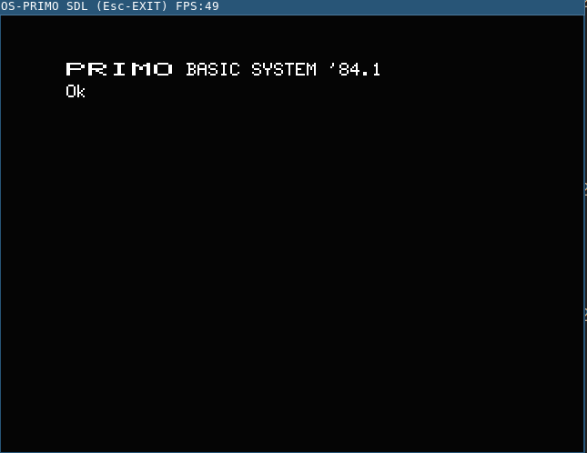
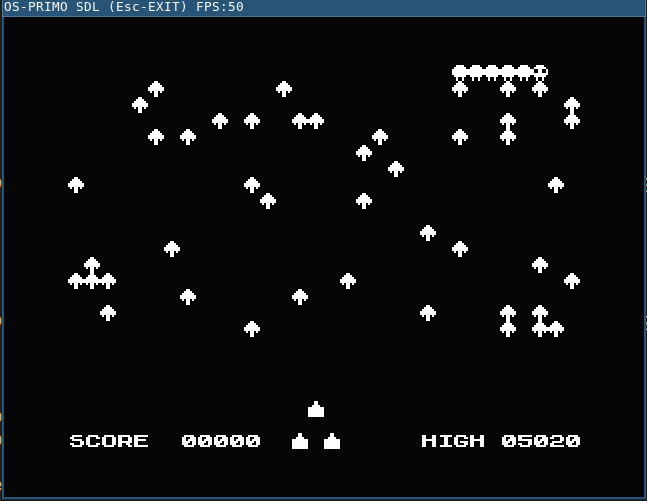
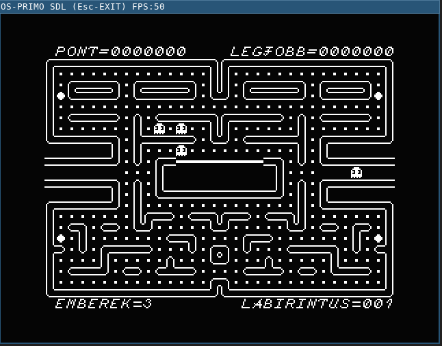

# OS-PRIMO Linux (SDL2) port

This is a simple, yet not very powerful PRIMO computer emulator based on OS-PRIMO source code by Jozsef Laszlo http://primo.homeserver.hu/

## About PRIMO

PRIMO is an 8-bit computer from the middle of '80 produced in Hungary. Based on Z80 CPU clone that running on 2.5 MHz or 3.75 MHz. It has monochrome graphics with resolution of 256x192. No sprites, and only had a beeper for sound. There are 16Kb, 32Kb and 48Kb versions. The ROM is always 16Kb. For more information and history facts, please visit http://primo.homeserver.hu/

## About the emulator

The emulation core is based on Marat Fayzullin's Z80 CPU emulator. The emulator emulates PRIMO A64 version, which has 48Kb of RAM. You can choose between 2.5 MHz or 3.75 MHz. The emulator itself is not very cycle accurate, if you need a more precise emulator then you should try Ultimo (http://primo.homeserver.hu/html/ultimoelozmenyek.html) by Attila Grósz, who is a well known emulator guru, and unlike me, he knows what he's doing. Unfortunately, it is a Windows only application, but luckily it runs well on Linux with WINE.

The emulator uses SDL2 library for graphics and user interaction, therefore the source code should be reasonably portable. There is only support for .PRI files, and the emulator can only read them and start them automatically (depends on the save mode).


### Build

The project uses plain GNU Makefile and does not have dependency on anything but SDL2, so the compilation should be straightforward. To build the application, execute:

```
$ make
```
### Run the emulator

The emulator can be run from the shell, it has only one optional parameter and that is the .PRI filename which need to be loaded. To run the emulator, execute:

```
$ ./primo
```

or with .PRI file
```
$ ./primo TEST.PRI
```

You can find some sample .PRI files in the origina/OS-PRIMO/pri folder.

The make file also contains a target which can run the original version written for DOS in DOSBox. To execute original version:

```
$ make run-original
```

## Other files in the project

The project also contains a disassembled version of the PRIMO ROM in Ghidra (https://ghidra-sre.org/). Not very well disassembled, I just needed a quick view on some parts of the ROM to understand more how the system works. You can find the Ghidra files in "misc/rom" folder.

## Screenshots

Startup screen:



Centipede by Gabor Paller 1988.



Hamm:




Happy computing :-)

---

SDL2 library
https://libsdl.org/

Original OS-PRIMO site
http://primo.homeserver.hu/html/osprimo.html

Marat Fayzullin's emulator page
https://fms.komkon.org/EMUL8/

Ultimo by Attila Grósz
http://primo.homeserver.hu/html/ultimoelozmenyek.html
